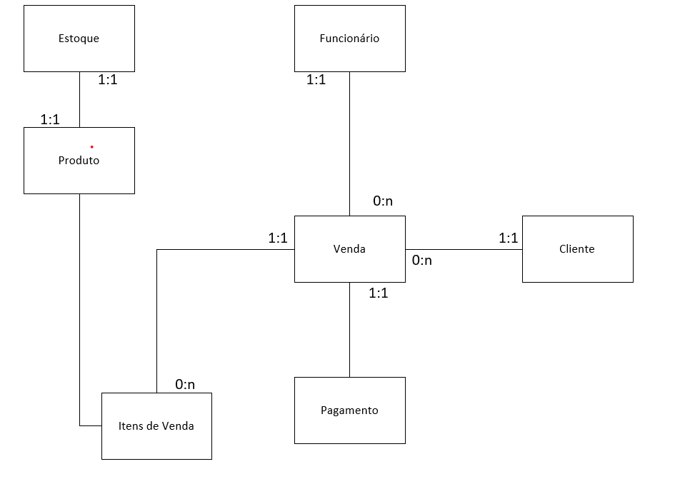
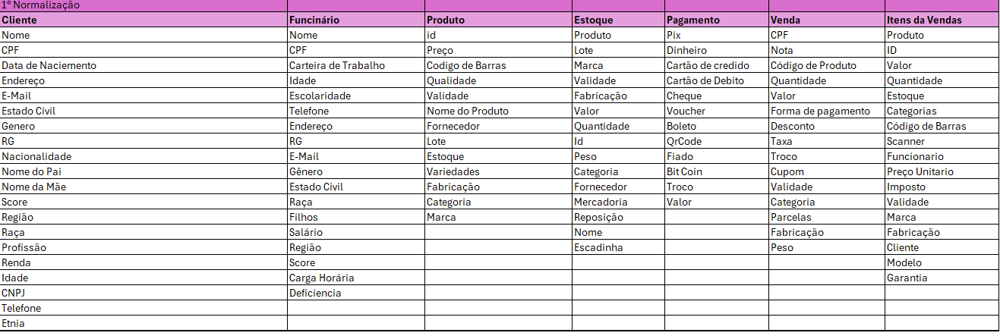
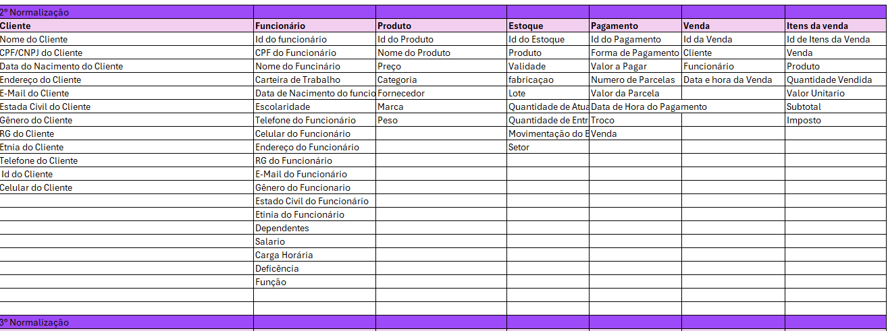
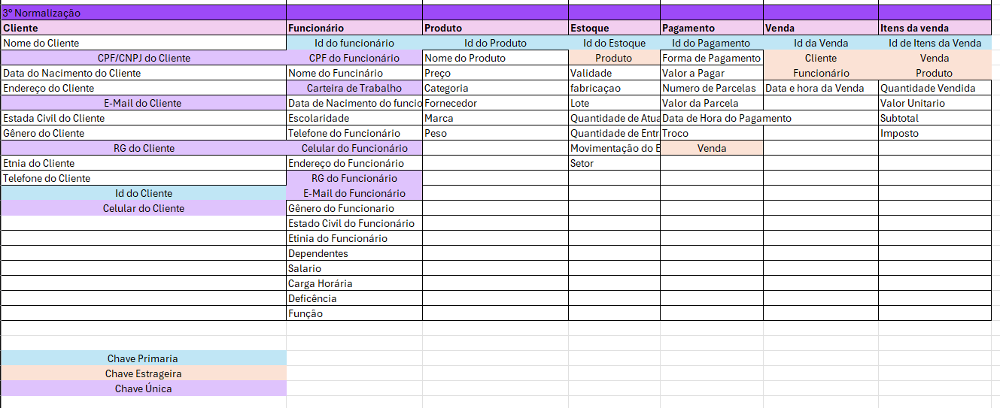
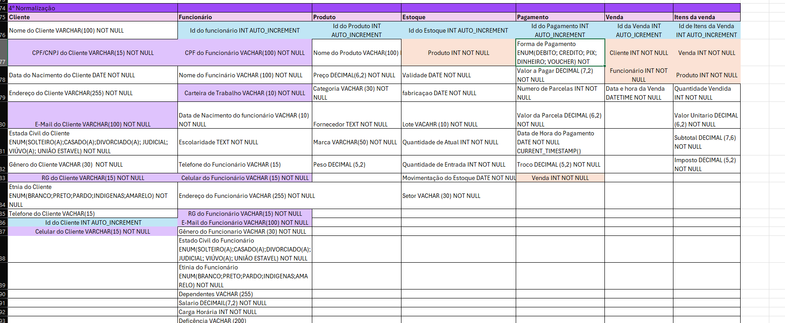
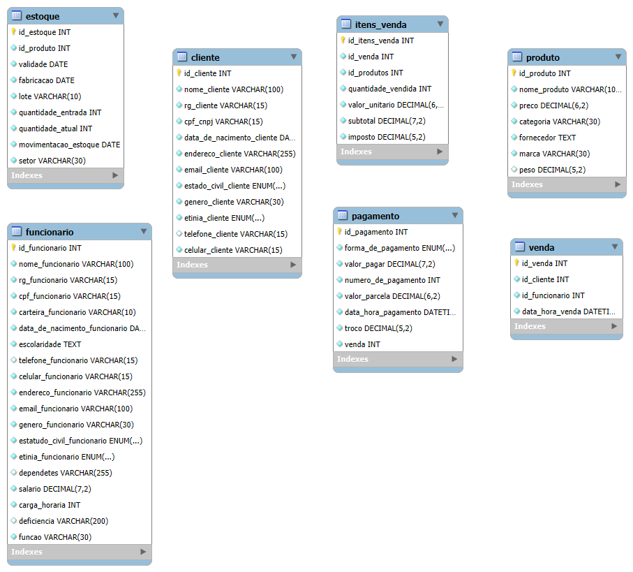

# Casa Oliveira
## Estudo de caso

Roberto é dono de um mercado no bairro de Vargem Grande, na cidade de 
Tupã. Ele herdou o negócio de seu pai, Gumercindo Oliveira. O negócio 
iniciou em 1978 na garagem da casa da família, era uma pequena quitanda. 
Com o passar dos anos, o negócio cresceu, e Gumercindo mudou-se para 
um local maior, onde permaneceu até os dias atuais.
Roberto, o novo dono do mercado, continuou o negócio da mesma forma que 
o pai. Ele comprava grandes volumes de produtos diretamente com os 
fornecedores e os armazenava em seu estoque. Às vezes, ele comprava 
muitos produtos mesmo já tendo estoque, o que causava uma sobrecarga. 
Além disso, tinha muitos produtos estragados, tais como: frutas, legumes, 
iogurtes, leites, frango, etc. Também havia muitos produtos com o prazo de 
validade vencido.
Os funcionários eram poucos e faziam muitas coisas ao mesmo tempo. O 
açougueiro também ajudava no estoque; a moça da limpeza ajudava na 
organização dos produtos das prateleiras, além de auxiliar na padaria. 
Quando o caixa estava vazio, o operador ajudava a repor os laticínios e a 
limpar a loja. O repositor também trabalhava no caixa.
Ao realizar a venda, Roberto, que sabia o nome de quase todos os clientes, 
anotava em um caderno todos os produtos vendidos e o que havia em 
estoque. Ao fim do dia, ele pegava o caderno e fazia os cálculos de quanto 
havia vendido, somando o faturamento e atualizando o estoque. Esse 
processo é feito todos os dias e toma um tempo considerável para ser 
concluído.
Roberto fechava a loja às 18h, mas só ia para casa às 22h, após fazer todas 
as operações necessárias. Mesmo assim, o negócio vai bem, e Roberto 
pretende mudar-se para outro ponto, aumentar o volume de negócios e 
contratar novos funcionários.
Márcia, esposa de Roberto, vem conversando com ele há muito tempo para 
que contrate uma empresa para construir um sistema de informática para 
gerenciar o negócio. O objetivo é reduzir o tempo que ele passa trabalhando, 
obter melhor organização dos produtos, maior lucratividade e melhorar a 
gestão.
Com a intenção de aumentar o negócio, Roberto está disposto a informatizar 
sua empresa. Vamos ajudá-lo. Começaremos construindo o banco de dados.

### Elementos levantados

- Estoque 
- Funcionário
- Venda
- Cliente   
- Pagamento
- Produto 
- Itens da Venda 


### Modelo Conceitual


### Modelo Conceitual Relacionamento 



### Normalizações 

### Normalização 1


### Normalização 2


### Normalização 3



### Normalização 4



#### Diagrama de tebelas 


#### MER - Modelo de entidade Relacional


### Modelo Fisico 

``` sql


CREATE TABLE `cliente` (
  `id_cliente` int NOT NULL AUTO_INCREMENT,
  `nome_cliente` varchar(100) NOT NULL,
  `rg_cliente` varchar(15) NOT NULL,
  `cpf_cnpj` varchar(15) NOT NULL,
  `data_de_nacimento_cliente` date NOT NULL,
  `endereco_cliente` varchar(255) NOT NULL,
  `email_cliente` varchar(100) NOT NULL,
  `estado_civil_cliente` enum('Solteiro(a)','Casado(a)','Divorciado(a)','Separeção Judicial','Viúvo(a)','União Estavel') NOT NULL,
  `genero_cliente` varchar(30) NOT NULL,
  `etinia_cliente` enum('Branco','Pardo','Indigenas','Amarelo') NOT NULL,
  `telefone_cliente` varchar(15) DEFAULT NULL,
  `celular_cliente` varchar(15) NOT NULL,
  PRIMARY KEY (`id_cliente`),
  UNIQUE KEY `rg_cliente` (`rg_cliente`),
  UNIQUE KEY `cpf_cnpj` (`cpf_cnpj`),
  UNIQUE KEY `celular_cliente` (`celular_cliente`)
) ENGINE=InnoDB DEFAULT CHARSET=utf8mb4 COLLATE=utf8mb4_0900_ai_ci;


DROP TABLE IF EXISTS `funcionario`;

CREATE TABLE `funcionario` (
  `id_funcionario` int NOT NULL AUTO_INCREMENT,
  `nome_funcionario` varchar(100) NOT NULL,
  `rg_funcionario` varchar(15) NOT NULL,
  `cpf_funcionario` varchar(15) NOT NULL,
  `carteira_funcionario` varchar(10) NOT NULL,
  `data_de_nacimento_funcionario` date NOT NULL,
  `escolaridade` text NOT NULL,
  `telefone_funcionario` varchar(15) DEFAULT NULL,
  `celular_funcionario` varchar(15) NOT NULL,
  `endereco_funcionario` varchar(255) NOT NULL,
  `email_funcionario` varchar(100) NOT NULL,
  `genero_funcionario` varchar(30) NOT NULL,
  `estatudo_civil_funcionario` enum('Solteiro(a)','Casado(a)','Divorciado(a)','Separeção Judicial','Viúvo(a)','União Estavel') NOT NULL,
  `etinia_funcionario` enum('Branco','Pardo','Indigenas','Amarelo') NOT NULL,
  `dependetes` varchar(255) DEFAULT NULL,
  `salario` decimal(7,2) NOT NULL,
  `carga_horaria` int NOT NULL,
  `deficiencia` varchar(200) DEFAULT NULL,
  `funcao` varchar(30) NOT NULL,
  PRIMARY KEY (`id_funcionario`),
  UNIQUE KEY `rg_funcionario` (`rg_funcionario`),
  UNIQUE KEY `cpf_funcionario` (`cpf_funcionario`),
  UNIQUE KEY `carteira_funcionario` (`carteira_funcionario`),
  UNIQUE KEY `celular_funcionario` (`celular_funcionario`)
) ENGINE=InnoDB DEFAULT CHARSET=utf8mb4 COLLATE=utf8mb4_0900_ai_ci;

DROP TABLE IF EXISTS `produto`;

CREATE TABLE `produto` (
  `id_produto` int NOT NULL AUTO_INCREMENT,
  `nome_produto` varchar(100) NOT NULL,
  `preco` decimal(6,2) NOT NULL,
  `categoria` varchar(30) NOT NULL,
  `fornecedor` text NOT NULL,
  `marca` varchar(30) NOT NULL,
  `peso` decimal(5,2) DEFAULT NULL,
  PRIMARY KEY (`id_produto`)
) ENGINE=InnoDB DEFAULT CHARSET=utf8mb4 COLLATE=utf8mb4_0900_ai_ci;

DROP TABLE IF EXISTS `estoque`;

CREATE TABLE `estoque` (
  `id_estoque` int NOT NULL AUTO_INCREMENT,
  `id_produto` int NOT NULL,
  `validade` date NOT NULL,
  `fabricacao` date NOT NULL,
  `lote` varchar(10) NOT NULL,
  `quantidade_entrada` int NOT NULL,
  `quantidade_atual` int NOT NULL,
  `movimentacao_estoque` date NOT NULL,
  `setor` varchar(30) NOT NULL,
  PRIMARY KEY (`id_estoque`)
) ENGINE=InnoDB DEFAULT CHARSET=utf8mb4 COLLATE=utf8mb4_0900_ai_ci;

DROP TABLE IF EXISTS `pagamento`;

CREATE TABLE `pagamento` (
  `id_pagamento` int NOT NULL AUTO_INCREMENT,
  `forma_de_pagamento` enum('Debito','Credito','Pix','Dinheiro','Voucher') NOT NULL,
  `valor_pagar` decimal(7,2) NOT NULL,
  `numero_de_pagamento` int NOT NULL,
  `valor_parcela` decimal(6,2) NOT NULL,
  `data_hora_pagamento` datetime NOT NULL DEFAULT CURRENT_TIMESTAMP,
  `troco` decimal(5,2) NOT NULL,
  `venda` int NOT NULL,
  PRIMARY KEY (`id_pagamento`)
) ENGINE=InnoDB DEFAULT CHARSET=utf8mb4 COLLATE=utf8mb4_0900_ai_ci;

DROP TABLE IF EXISTS `venda`;

CREATE TABLE `venda` (
  `id_venda` int NOT NULL AUTO_INCREMENT,
  `id_cliente` int NOT NULL,
  `id_funcionario` int NOT NULL,
  `data_hora_venda` datetime NOT NULL DEFAULT CURRENT_TIMESTAMP,
  PRIMARY KEY (`id_venda`)
) ENGINE=InnoDB DEFAULT CHARSET=utf8mb4 COLLATE=utf8mb4_0900_ai_ci;

DROP TABLE IF EXISTS `itens_venda`;

CREATE TABLE `itens_venda` (
  `id_itens_venda` int NOT NULL AUTO_INCREMENT,
  `id_venda` int NOT NULL,
  `id_produtos` int NOT NULL,
  `quantidade_vendida` int NOT NULL,
  `valor_unitario` decimal(6,2) NOT NULL,
  `subtotal` decimal(7,2) NOT NULL,
  `imposto` decimal(5,2) NOT NULL,
  PRIMARY KEY (`id_itens_venda`)
) ENGINE=InnoDB DEFAULT CHARSET=utf8mb4 COLLATE=utf8mb4_0900_ai_ci;

```